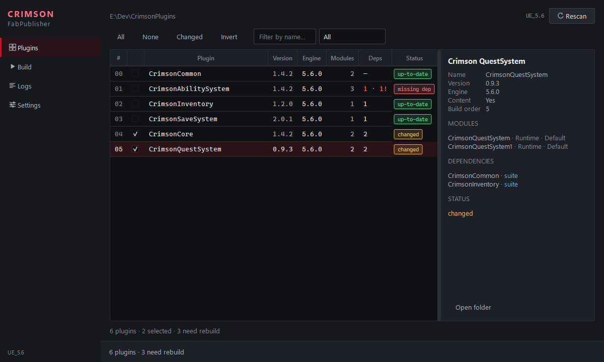

# CrimsonFabPublisher

[](https://github.com/CarlosAFernandez89/CrimsonFabPublisher/actions/workflows/build.yml)
[](LICENSE)

Build a suite of interdependent Unreal Engine plugins into FAB-ready submission zips —
without hand-tracking which ones changed.



## Why

Packaging one plugin is easy. Packaging *twenty interdependent* plugins is not: edit a shared
module and every plugin downstream of it has to be rebuilt and resubmitted, or you ship a
mismatch. Tracking that by hand is where mistakes happen.

This tool reads your whole suite, works out the dependency graph, hashes each plugin's
source, and tells you exactly what needs rebuilding — then builds it in the right order.

## What it does

- **Dependency-aware** — classifies every `.uplugin` dependency as *suite*, *engine* or
  *external*, and builds in topological order
- **Change detection** — SHA-256 over each plugin's source, excluding build artifacts, so a
  rebuild alone never counts as a change
- **Resubmission impact** — change one plugin and everything downstream is flagged
- **Toolchain aware** — checks the installed Linux toolchain against the exact version your
  engine pins, instead of failing at link time
- **Real cancel** — kills the whole compiler process tree in ~2s, not "after the current plugin"
- **Listing staging** — generates the paste-ready listing text, checks it against Fab's
  published requirements, and diffs it against what you last submitted so you can see
  which edits will cost you a review
- **Diagnostics** — structured logs with severity, per-plugin grouping and export

## What it does not do

It does not upload anything. Despite the name there is no Fab API integration, no
authentication, and no network access — `QtNetwork` is excluded from the build. It produces
the zips and the listing text; you drag them into the Fab seller portal yourself.

## Install

Download `CrimsonFabPublisher.exe` from
[Releases](https://github.com/CarlosAFernandez89/CrimsonFabPublisher/releases/latest).

Single self-contained executable, ~45 MB. Nothing to install, no `PATH` changes, no registry
keys. Settings live in `%APPDATA%\CrimsonFabPublisher\`.

Or run from source:

```bash
python -m venv .venv && .venv\Scripts\activate
pip install -r requirements.txt
python main.py
```

## Quick start

1. **Choose folder…** — the folder *containing* your plugin directories
2. Pick an engine and target platforms on the **Build** page
3. Hit **Changed** to select everything that needs rebuilding
4. **Build selected** — dependencies are pulled in automatically

Full walkthrough: [Getting Started](https://github.com/CarlosAFernandez89/CrimsonFabPublisher/wiki/Getting-Started).

## Listings

Building the zip is half a submission. The other half is the listing page, and Fab has no API
for it — so it gets typed into the web form by hand, every time, with no record of what you
last sent.

The **Listings** page writes the text for you to paste, validates it against
[Fab's published requirements](https://www.fab.com/o/technical-requirements) before you start,
and remembers what you submitted. On the next update it tells you which fields moved and,
crucially, **which of them re-enter Fab review** — Fab applies tag and price edits instantly
but sends a description or thumbnail change back through approval.

There is also an **Ask Claude** button that drafts the description from what the app already
knows about the plugin — its modules, dependencies, and Blueprint and C++ counts. It needs the
[Claude CLI](https://claude.com/claude-code); without it, the button copies the prompt instead.

Your copy lives in a folder you choose (defaulting to `Documents\CrimsonFabPublisher\Listings`),
not in this repository — see [Listings](https://github.com/CarlosAFernandez89/CrimsonFabPublisher/wiki/Listings).

## Documentation

| | |
|---|---|
| [Getting Started](https://github.com/CarlosAFernandez89/CrimsonFabPublisher/wiki/Getting-Started) | First scan and build |
| [Engine Detection](https://github.com/CarlosAFernandez89/CrimsonFabPublisher/wiki/Engine-Detection) | How engines are found, adding them manually |
| [Target Platforms](https://github.com/CarlosAFernandez89/CrimsonFabPublisher/wiki/Target-Platforms) | Linux / Android toolchain setup and version pinning |
| [How Change Detection Works](https://github.com/CarlosAFernandez89/CrimsonFabPublisher/wiki/How-Change-Detection-Works) | Hashing, build order, resubmission impact |
| [Packaging](https://github.com/CarlosAFernandez89/CrimsonFabPublisher/wiki/Packaging) | RunUAT flags, zip naming, exclusions |
| [Listings](https://github.com/CarlosAFernandez89/CrimsonFabPublisher/wiki/Listings) | Staging listing copy, what re-enters Fab review, Ask Claude |
| [Troubleshooting](https://github.com/CarlosAFernandez89/CrimsonFabPublisher/wiki/Troubleshooting) | When something says "not detected" |

## Development

```bash
set QT_QPA_PLATFORM=offscreen
python -m pytest -q          # 421 tests, ~20s
.\build_exe.ps1              # -> dist\CrimsonFabPublisher.exe
```

The domain layer (`fabpublisher/`) imports no Qt, so every algorithm is testable without a
`QApplication`; anything needing a widget lives in `fabpublisher/ui/`.

More in [Development](https://github.com/CarlosAFernandez89/CrimsonFabPublisher/wiki/Development).

## Requirements

Windows 10/11 · Unreal Engine with `RunUAT.bat` · Python 3.11+ (source only)

## License

[MIT](LICENSE)
